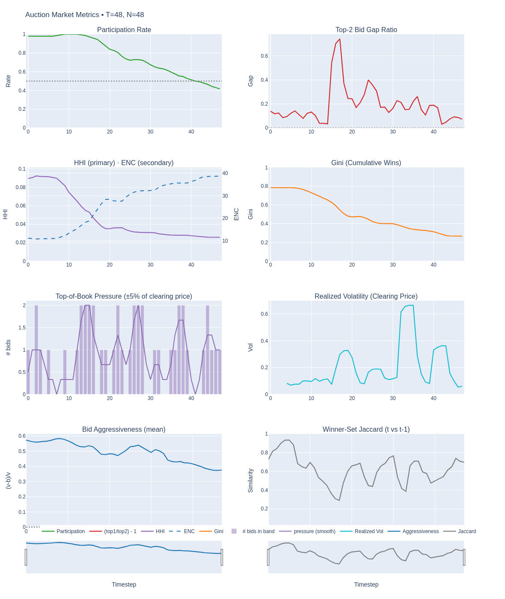
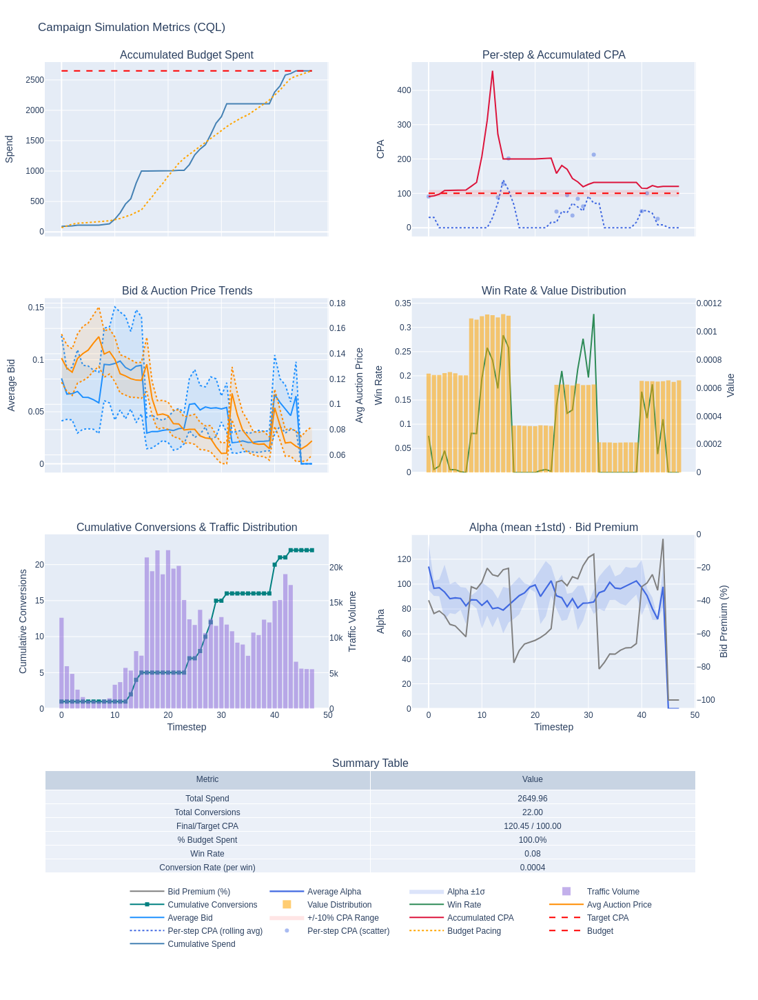

# RLBidder

<p align="center">
  
</p>


<p align="center"><strong>Reinforcement learning auto-bidding library 
for research and production.</strong></p>

<p align="center">
  <a href="https://pypi.org/project/rlbidder/"></a>
  
  
  
  <a href="#quickstart"></a>
</p>

<p align="center">
  <a href="#-overview">Overview</a> •
  <a href="#-who-should-use-rlbidder">Who Should Use This</a> •
  <a href="#installation">Installation</a> •
  <a href="#quickstart">Quickstart</a> •
  <a href="#benchmarking-results">Benchmarks</a> •
  <a href="#-module-guide">API</a> •
  <a href="#citation">Citation</a>
</p>

---

## 📖 Overview

`rlbidder` is a comprehensive toolkit for training and deploying reinforcement learning agents in online advertising auctions. Built for both **industrial scale** and **research agility**, it provides:

- **Complete offline RL pipeline**: Rust-powered data processing (Polars) → SOTA algorithms (IQL, CQL, DT, GAVE) → parallel evaluation
- **Modern ML infrastructure**: PyTorch Lightning multi-GPU training, experiment tracking, automated reproducibility
- **Production insights**: Interactive dashboards for campaign monitoring, market analytics, and agent behavior analysis
- **Research rigor**: Statistically robust benchmarking with RLiable metrics, tuned control baselines, and round-robin evaluation

Whether you're deploying bidding systems at scale or researching novel RL methods, `rlbidder` bridges the gap between academic innovation and production readiness.

---

## 🎯 Who Should Use rlbidder?

**Researchers** looking to experiment with SOTA offline RL algorithms (IQL, CQL, DT, GAVE, GAS) on realistic auction data with rigorous benchmarking.

**AdTech Practitioners** comparing RL agents against classic baselines (PID, BudgetPacer) before production deployment.

---

## 🚀 Key Features & What Makes rlbidder Different

`rlbidder` pushes beyond conventional RL libraries by integrating cutting-edge techniques from both RL research and modern LLM/transformer architectures. Here's what sets it apart:

### **Rust-Powered Data Pipeline**
- **Standardized workflow**: Scan Parquet → RL Dataset → Feature Engineering → DT Dataset with reproducible artifacts at every stage
- **Polars Lazy API**: Streaming data processing with a blazingly fast Rust engine that handles massive datasets without memory overhead
- **Scalable workflows**: Process 100GB+ auction logs efficiently with lazy evaluation and zero-copy operations
- **Feature engineering**: Drop-in scikit-learn-style transformers (Symlog, Winsorizer, ReturnScaledReward) for states, actions, and rewards

### **State-of-the-Art RL Algorithms**
- **Comprehensive baselines**: Classic control (Heuristic, BudgetPacer, PID) and learning-based methods (BC, CQL, IQL, DT, GAVE, GAS)
- **HL-Gauss Distributional RL**: Smooth Gaussian-based distributional Q-learning for improved uncertainty quantification, advancing beyond standard categorical approaches
- **Efficient ensemble critics**: Leverage `torch.vmap` for vectorized ensemble operations—much faster than traditional loop-based implementations
- **Numerically stable stochastic policies**: DreamerV3-style `SigmoidRangeStd` and TorchRL-style `BiasedSoftplus` to avoid numerical instabilities from exp/log operations

### **Modern Transformer Stack (LLM-Grade)**
- **FlashAttention (SDPA)**: Uses latest PyTorch scaled dot-product attention API for accelerated training
- **RoPE positional encoding**: Rotary positional embeddings for improved sequence length generalization, adopted from modern LLMs
- **QK-Norm**: Query-key normalization for enhanced training stability at scale
- **SwiGLU**: Advanced feed-forward networks for superior expressiveness
- **Efficient inference**: `DTInferenceBuffer` with deque-based temporal buffering for online Decision Transformer deployment

### **Simulated Online Evaluation & Visualization**
- **Parallel evaluation**: Multi-process evaluators with pre-loaded data per worker—much faster than sequential benchmarking
- **Robust testing**: Round-robin agent rotation with multi-seed evaluation for statistically reliable comparisons
- **Tuned competitors**: Classic control methods (BudgetPacer, PID) with optimized hyperparameters as baselines
- **Interactive dashboards**: Production-ready Plotly visualizations with market structure metrics (HHI, Gini, volatility) and RLiable metrics
- **Industrial analytics**: Campaign health monitoring, budget pacing diagnostics, auction dynamics, and score distribution analysis

### **Modern ML Engineering Stack**
- **Modular design**: Enables both production readiness and rapid prototyping
- **PyTorch Lightning**: Reduce boilerplate code, automatic mixed precision, gradient accumulation
- **Draccus configuration**: Type-safe dataclass-to-CLI with hierarchical configs, dot-notation overrides, and zero boilerplate
- **Local experiment tracking**: AIM for experiment management without external cloud dependencies

### **Comparison with AuctionNet**

| Feature | AuctionNet | rlbidder |
|---------|-----------|----------|
| **Data Engine** | Pandas | **Polars Lazy (Rust)** ✨ |
| **Configuration** | argparse | **Draccus (dataclass-to-CLI)** ✨ |
| **Distributional RL** | ❌ | **HL-Gauss** ✨ |
| **Ensemble Method** | ❌ | **torch.vmap** ✨ |
| **Transformer Attention** | Standard | **SDPA/FlashAttn** ✨ |
| **Positional Encoding** | Learned | **RoPE** ✨ |
| **Policy Stability** | exp(log_std) | **SigmoidRangeStd/BiasedSoftplus** ✨ |
| **Parallel Evaluation** | ❌ | **ProcessPool + Round-robin** ✨ |
| **Visualization** | ❌ | **Production Dashboards** ✨ |

---

## 📊 Benchmarking Results

We evaluate all agents using rigorous statistical methods across multiple delivery periods with round-robin testing and multi-seed evaluation. The evaluation protocol follows RLiable best practices for statistically reliable algorithm comparison.

<table>
  <tr>
    <td width="50%" align="center">
      
      <p><strong>Score Distribution Analysis</strong><br/>Violin plots showing performance distributions across agents and seeds.</p>
    </td>
    <td width="50%" align="center">
      
      <p><strong>Mean Performance Comparison</strong><br/>Aggregated performance metrics with confidence intervals.</p>
    </td>
  </tr>
  <tr>
    <td colspan="2" align="center">
      
      <p><strong>RLiable Statistical Metrics</strong><br/>Performance profiles and aggregate metrics following RLiable best practices.</p>
    </td>
  </tr>
</table>

---

## 📈 Interactive Dashboards & Gallery

Beyond raw performance metrics, `rlbidder` helps you understand *why* agents behave the way they do. Production-grade interactive dashboards summarize policy behavior, campaign health, and auction dynamics for both research insights and production monitoring.

<table>
  <tr>
    <td width="50%" align="center">
      
      <p><strong>Auction market analysis</strong><br/>Market concentration, volatility, and competitiveness.</p>
    </td>
    <td width="50%" align="center">
      
      <p><strong>Campaign analysis (CQL)</strong><br/>Segment-level delivery quality and conversion outcomes.</p>
    </td>
  </tr>
  <tr>
    <td width="50%" align="center">
      
      <p><strong>Budget pacing (CQL)</strong><br/>Daily spend pacing and CPA stabilization diagnostics.</p>
    </td>
    <td width="50%" align="center">
      
      <p><strong>Auction metrics scatterplots</strong><br/>Spend, conversion, ROI, and win-rate trade-offs.</p>
    </td>
  </tr>
</table>


---

## 🚀 Getting Started

### Installation

#### Prerequisites

- Python 3.11 or newer
- PyTorch 2.6 or newer (follow [PyTorch install guide](https://pytorch.org/get-started/locally/))
- GPU with 8GB+ vRAM recommended for training

#### Local Development

```bash
git clone https://github.com/zuoxingdong/rlbidder.git
cd rlbidder
pip install -e .
```

---

### Quickstart

Follow the steps below to reproduce the full offline RL workflow on processed campaign data. 

#### Step 1: Data Preparation

```bash
# Download sample competition data (periods 7-8 and trajectory 1)
bash scripts/download_raw_data.sh -p 7-8,traj1 -d data/raw

# Convert raw CSV to Parquet (faster I/O with Polars)
python scripts/convert_csv_to_parquet.py --raw_data_dir=data/raw

# Build evaluation-period parquet files
python scripts/build_eval_dataset.py --data_dir=data

# Create training transitions (trajectory format for offline RL)
python scripts/build_transition_dataset.py --data_dir=data --mode=trajectory

# Fit scalers for state, action, and reward normalization
python scripts/scale_transitions.py --data_dir=data --output_dir=scaled_transitions

# Generate Decision Transformer trajectories with return-to-go
python scripts/build_dt_dataset.py \
  --build.data_dir=data \
  --build.reward_type=reward_dense \
  --build.use_scaled_reward=true
```

**What you'll have:** Preprocessed datasets in `data/processed/` and fitted scalers in `data/scaled_transitions/` ready for training.

#### Step 2: Train Agents

```bash
# Train IQL (Implicit Q-Learning) - value-based offline RL
python examples/train_iql.py \
  --model_cfg.lr_actor 3e-4 \
  --model_cfg.lr_critic 3e-4 \
  --model_cfg.num_q_models 5 \
  --model_cfg.bc_alpha 0.01 \
  --train_cfg.enable_aim_logger=False

# Train DT (Decision Transformer) - sequence modeling for RL
python examples/train_dt.py \
  --model_cfg.embedding_dim 512 \
  --model_cfg.num_layers 6 \
  --model_cfg.lr 1e-4 \
  --model_cfg.rtg_scale 98 \
  --model_cfg.target_rtg 2.0 \
  --train_cfg.enable_aim_logger=False
```

**What you'll have:** Trained model checkpoints in `examples/checkpoints/` with scalers and hyperparameters.

**💡 Configuration powered by draccus:** All training scripts use type-safe dataclass configs with automatic CLI generation. Override any nested config with dot-notation (e.g., `--model_cfg.lr 1e-4`) or pass config files directly.

**💡 Track experiments with Aim:** All training scripts automatically log metrics, hyperparameters, and model artifacts to Aim (a local experiment tracker). 
To use Aim, first initialize your project with:

```bash
aim init
```

Then launch the Aim UI to visualize training progress:

```bash
aim up --port 43800
```

Then open `http://localhost:43800` in your browser to explore training curves, compare runs, and analyze hyperparameter configurations.

#### Step 3: Evaluate in Simulated Auctions

```bash
# Evaluate IQL agent with parallel multi-seed evaluation
python examples/evaluate_agents.py \
  --evaluation.data_dir=data \
  --evaluation.evaluator_type=OnlineCampaignEvaluator \
  --evaluation.delivery_period_indices=[7,8] \
  --evaluation.num_seeds=5 \
  --evaluation.num_workers=8 \
  --evaluation.output_dir=examples/eval \
  --agent.agent_class=IQLBiddingAgent \
  --agent.model_dir=examples/checkpoints/iql \
  --agent.checkpoint_file=best.ckpt
```

**What you'll have:** Evaluation reports, campaign summaries, and auction histories in `examples/eval/` ready for visualization.

**Next steps:** Generate dashboards with `examples/performance_visualization.ipynb` or explore the evaluation results with Polars DataFrames.

---

## 📦 Module Guide

Each module handles a specific aspect of the RL bidding pipeline:

| Module | Description | Key Classes/Functions |
| --- | --- | --- |
| 📚 `rlbidder.agents` | Offline RL agents and control baselines | `IQLModel`, `CQLModel`, `DTModel`, `GAVEModel`, `BudgetPacerBiddingAgent` |
| 🔧 `rlbidder.data` | Data processing, scalers, and datasets | `OfflineDataModule`, `TrajDataset`, `SymlogTransformer`, `WinsorizerTransformer` |
| 🏪 `rlbidder.envs` | Auction simulation and value sampling | `OnlineAuctionEnv`, `ValueSampler`, `sample_conversions` |
| 🎯 `rlbidder.evaluation` | Multi-agent evaluation and metrics | `ParallelOnlineCampaignEvaluator`, `OnlineCampaignEvaluator` |
| 🧠 `rlbidder.models` | Neural network building blocks | `StochasticActor`, `EnsembledQNetwork`, `NormalHead`, `HLGaussLoss` |
| 📊 `rlbidder.viz` | Interactive dashboards and analytics | `create_campaign_dashboard`, `create_market_dashboard`, `plot_rliable_metrics` |
| 🛠️ `rlbidder.utils` | Utilities and helpers | `set_seed`, `log_distribution`, `regression_report` |

---

## 🏗️ Architecture

The library follows a modular design with clear separation of concerns. Data flows from raw logs through preprocessing, training, and evaluation to final visualization:

```mermaid
flowchart TD
    subgraph Data["📦 Data Pipeline"]
        direction TB
        raw["Raw Campaign Data<br/><i>CSV/Parquet logs</i>"]
        scripts["Build Scripts<br/>convert • build_eval<br/>build_transition • scale"]
        artifacts["📁 Preprocessed Artifacts<br/>processed/ • scaled_transitions/<br/><i>Parquet + Scalers</i>"]
        
        raw -->|transform| scripts
        scripts -->|generate| artifacts
    end

    subgraph Core["⚙️ Core Library Modules"]
        direction TB
        data_mod["<b>rlbidder.data</b><br/>OfflineDataModule<br/>TrajDataset • ReplayBuffer<br/>🔧 <i>Handles batching & scaling</i>"]
        models["<b>rlbidder.models</b><br/>StochasticActor • EnsembledQNetwork<br/>ValueNetwork • Losses • Optimizers<br/>🧠 <i>Agent building blocks</i>"]
        agents["<b>rlbidder.agents</b><br/>IQLModel • CQLModel • DTModel<br/>📚 <i>LightningModule implementations</i>"]
        
        agents -->|composes| models
    end

    subgraph Training["🔥 Training Pipeline"]
        direction TB
        train["<b>examples/train_iql.py</b><br/>🎛️ Config + CLI<br/><i>Orchestration script</i>"]
        trainer["⚡ Lightning Trainer<br/>fit() • validate()<br/><i>Multi-GPU support</i>"]
        ckpt["💾 Model Checkpoints<br/>best.ckpt • last.ckpt<br/><i>+ scalers + hparams</i>"]
        
        train -->|instantiates| data_mod
        train -->|instantiates| agents
        train -->|launches| trainer
        trainer -->|saves| ckpt
    end

    subgraph Eval["🎯 Online Evaluation"]
        direction TB
        evaluator["<b>rlbidder.evaluation</b><br/>OnlineCampaignEvaluator<br/>ParallelEvaluator<br/>🔄 <i>Multi-seed, round-robin</i>"]
        env["<b>rlbidder.envs</b><br/>Auction Simulator<br/>🏪 <i>Multi-agent market</i>"]
        results["📈 Evaluation Results<br/>Campaign Reports • Agent Summaries<br/>Auction Histories<br/><i>Polars DataFrames</i>"]
        
        evaluator -->|simulates| env
        env -->|produces| results
    end

    subgraph Viz["📊 Visualization & Analysis"]
        direction TB
        viz["<b>rlbidder.viz</b><br/>Plotly Dashboards<br/>Market Metrics<br/>🎨 <i>Interactive HTML</i>"]
        plots["📉 Production Dashboards<br/>Campaign Health • Market Structure<br/>Budget Pacing • Scatter Analysis"]
        
        viz -->|renders| plots
    end

    artifacts ==>|loads| data_mod
    artifacts -.->|eval data| evaluator
    ckpt ==>|load_from_checkpoint| evaluator
    results ==>|consumes| viz

    classDef dataStyle fill:#1565c0,stroke:#0d47a1,stroke-width:3px,color:#fff,font-weight:bold
    classDef coreStyle fill:#ef6c00,stroke:#e65100,stroke-width:3px,color:#fff,font-weight:bold
    classDef trainStyle fill:#6a1b9a,stroke:#4a148c,stroke-width:3px,color:#fff,font-weight:bold
    classDef evalStyle fill:#2e7d32,stroke:#1b5e20,stroke-width:3px,color:#fff,font-weight:bold
    classDef vizStyle fill:#c2185b,stroke:#880e4f,stroke-width:3px,color:#fff,font-weight:bold
    
    class Data,raw,scripts,artifacts dataStyle
    class Core,data_mod,models,agents coreStyle
    class Training,train,trainer,ckpt trainStyle
    class Eval,evaluator,env,results evalStyle
    class Viz,viz,plots vizStyle
```



**Design Principles:**
- 🔌 **Modular** - Each component is independently usable and testable
- ⚡ **Scalable** - Polars + Lightning enable massive datasets and efficient training
- 🔄 **Reproducible** - Deterministic seeding, configuration management, and evaluation
- 🚀 **Production-ready** - Type hints, error handling, logging, and monitoring built-in

---

## 🤝 Contributing

- 🌟 Star the repo if you find it useful
- 🔀 Fork and submit PRs for bug fixes or new features
- 📝 Improve documentation and add examples
- 🧪 Add tests for new functionality


---

## 🌟 Acknowledgments

`rlbidder` builds upon ideas from:

- **[AuctionNet](https://github.com/alimama-tech/AuctionNet)** original pioneer, for auction environment and benchmark design
- **[PyTorch Lightning](https://github.com/Lightning-AI/pytorch-lightning)** for training infrastructure
- **[Draccus](https://github.com/dlwh/draccus)** for elegant dataclass-to-CLI configuration management
- **[TRL](https://github.com/huggingface/trl)** & **[Transformers](https://github.com/huggingface/transformers)** for modern transformer implementations
- **[Polars](https://github.com/pola-rs/polars)** for high-performance data processing
- **[PyTorch RL](https://github.com/pytorch/rl)** for RL algorithm

---

## 📝 Citation

If you use `rlbidder` in your work, please cite it using the BibTeX entry below.

```bibtex
@misc{zuo2025rlbidder,
  author = {Zuo, Xingdong},
  title = {RLBidder: Reinforcement learning auto-bidding library for research and production},
  year = {2025},
  publisher = {GitHub},
  journal = {GitHub repository},
  howpublished = {\url{https://github.com/zuoxingdong/rlbidder}}
}
```

---

## License

MIT License. See `LICENSE`.
